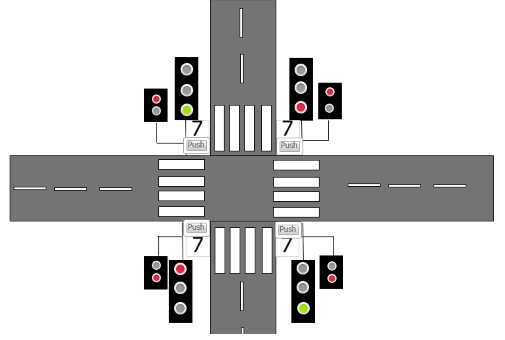
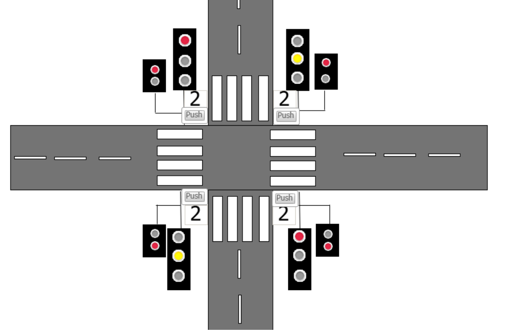
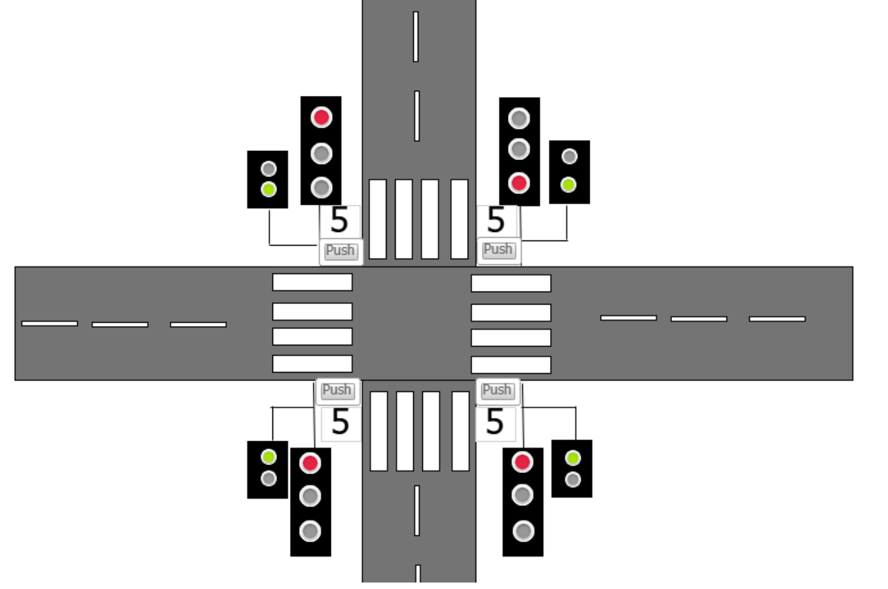

# PLC Traffic Light Simulator

PLC traffic light intersection simulator developed in CODESYS using Structured Text (ST).

## Features
- Vertical and horizontal traffic light control
- Pedestrian crossing request button
- Countdown timer
- Traffic light transition logic
- Visualization interface in CODESYS

## Technologies Used
- CODESYS
- Structured Text (IEC 61131-3)
- PLC Programming
- TON Timers
- CASE-based State Machine

## Screenshots

### Main Intersection

### Traffic Light Transition

### Pedestrian Crossing Activated
